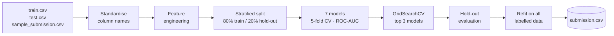

<div align="center">

# ❤️ Heart Disease Prediction

**An end-to-end ML pipeline: feature engineering → model comparison → tuning → `submission.csv`**


[Quick start](#-quick-start) •
[How it works](#-how-it-works) •
[Features](#-engineered-features) •
[Models](#-models--tuning) •
[Results](#-results) •
[FAQ](#-faq--troubleshooting)

</div>

---

## 📖 Overview

This project predicts the presence of heart disease from clinical measurements (age, blood pressure, cholesterol, max heart rate, ST depression, etc.) for a Kaggle Playground-style tabular competition.

The notebook:

- loads `train.csv`, `test.csv` and `sample_submission.csv`
- engineers 9 extra features with a single function applied identically to train and test
- compares **7 classifiers** with stratified cross-validation (scored by **ROC-AUC**)
- tunes the **top 3** with `GridSearchCV`
- evaluates the winner on an untouched hold-out set
- refits on all labelled data and writes a validated `submission.csv`

---

## 🚀 Quick start

```bash
# 1. Clone
git clone https://github.com/<your-username>/<your-repo>.git
cd <your-repo>

# 2. (Optional) create a virtual environment
python -m venv .venv
source .venv/bin/activate        # Windows: .venv\Scripts\activate

# 3. Install dependencies
pip install -r requirements.txt

# 4. Add the competition data (see "Project structure" below)

# 5. Run the notebook
jupyter notebook heart_fixed.ipynb
```

Run **Kernel → Restart & Run All**. When it finishes, `submission.csv` appears next to the notebook.

<details>
<summary><b>▶ Run it headless (no browser)</b></summary>

```bash
jupyter nbconvert --to notebook --execute heart_fixed.ipynb \
  --output executed.ipynb --ExecutePreprocessor.timeout=3600
```

</details>

<details>
<summary><b>▶ Run it on Kaggle / Colab</b></summary>

- **Kaggle:** add the competition data to a notebook, upload `heart_fixed.ipynb`, and run all cells. The notebook already searches `/kaggle/input/...` for the data.
- **Colab:** upload `train.csv`, `test.csv` and `sample_submission.csv` to the session's working directory, then run all cells.

</details>

---

## 🗂 Project structure

```text
.
├── heart_fixed.ipynb          # the full pipeline
├── requirements.txt           # Python dependencies
├── train.csv                  # ← you provide (Kaggle competition data)
├── test.csv                   # ← you provide
├── sample_submission.csv      # ← you provide (defines id/target columns & row order)
└── submission.csv             # ← generated by the notebook
```

> **Note:** the data files are not included in this repository. Download them from the competition page on Kaggle and place them in the project root (or in a `data/` folder).

---

## 🔄 How it works



<details>
<summary><b>▶ Design decisions worth knowing</b></summary>

- **No data leakage.** Imputation and scaling live inside `Pipeline` objects, so they are fitted per CV fold, never on held-out rows.
- **Scaling only where it matters.** Logistic Regression, SVM and Naive Bayes are scaled; tree models are not.
- **Fast iteration, full-data final fit.** Comparison and tuning run on a stratified sample (`SAMPLE_N`, default 30,000 rows). The final model is fitted on **all** labelled rows.
- **Schema-tolerant.** Column names are mapped to the classic UCI names, so both the Playground names (`Max HR`, `Chest pain type`, …) and the original ones (`thalach`, `cp`, …) work.
- **Self-checking output.** `submission.csv` is asserted to match `sample_submission.csv` in columns, row count and id order, with no missing values.

</details>

---

## 🧪 Engineered features

| Feature | Definition | Intuition |
|---|---|---|
| `chol_per_age` | `chol / age` | Cholesterol relative to age |
| `hr_pct_of_max` | `thalach / (220 − age)` | How close the patient got to predicted max heart rate |
| `hr_deficit` | `(220 − age) − thalach` | Shortfall from predicted max heart rate |
| `bp_chol_ratio` | `trestbps / chol` | Blood pressure vs. cholesterol |
| `age_x_oldpeak` | `age × oldpeak` | Age-scaled ST depression |
| `oldpeak_x_slope` | `oldpeak × slope` | ST depression combined with slope type |
| `age_bin` | ordinal band: `<40`, `40–49`, `50–59`, `60+` | Coarse age group (no gaps for out-of-range ages) |
| `any_vessels` | `ca > 0` | Any vessel coloured by fluoroscopy |
| `has_st_depression` | `oldpeak > 0` | Any ST depression present |

<details>
<summary><b>▶ Raw input columns (13)</b></summary>

| Playground name | Classic name | Meaning |
|---|---|---|
| Age | `age` | Age in years |
| Sex | `sex` | Sex |
| Chest pain type | `cp` | Chest pain category |
| BP | `trestbps` | Resting blood pressure |
| Cholesterol | `chol` | Serum cholesterol |
| FBS over 120 | `fbs` | Fasting blood sugar > 120 mg/dl |
| EKG results | `restecg` | Resting ECG result |
| Max HR | `thalach` | Maximum heart rate achieved |
| Exercise angina | `exang` | Exercise-induced angina |
| ST depression | `oldpeak` | ST depression induced by exercise |
| Slope of ST | `slope` | Slope of the peak-exercise ST segment |
| Number of vessels fluro | `ca` | Major vessels coloured by fluoroscopy |
| Thallium | `thal` | Thallium stress test result |

</details>

---

## 🤖 Models & tuning

| Model | Scaled | Tuned parameters |
|---|:---:|---|
| Logistic Regression | ✅ | `C` |
| Random Forest | ❌ | `max_depth`, `min_samples_leaf` |
| Gradient Boosting | ❌ | `max_depth`, `learning_rate` |
| SVM (RBF) | ✅ | `C` |
| Gaussian Naive Bayes | ✅ | `var_smoothing` |
| XGBoost | ❌ | `max_depth`, `learning_rate`, `n_estimators` |
| LightGBM | ❌ | `num_leaves`, `learning_rate`, `n_estimators` |

Every model has a search grid, so whichever three rank highest in cross-validation get tuned.

---

## ⚙️ Configuration

Edit the config cell at the top of the notebook:

| Setting | Default | What it does |
|---|---|---|
| `SEED` | `42` | Random seed for splits and models |
| `SAMPLE_N` | `30_000` | Rows used for model comparison and tuning |
| `CV_FOLDS` | `5` | Folds for the model comparison |
| `TUNE_FOLDS` | `3` | Folds for grid search |
| `SUBMIT_PROBA` | `True` | `True` → submit probabilities (best for ROC-AUC); `False` → hard 0/1 labels |
| `DATA_DIRS` | `['.', 'data', ...]` | Folders searched for the CSV files |

---

## 📊 Results

> Fill this in after running the notebook on the real competition data.

| Stage | ROC-AUC |
|---|---|
| Best CV score (tuned, on sample) | _TBD_ |
| Hold-out score | _TBD_ |
| Public leaderboard | _TBD_ |

<details>
<summary><b>
</b></summary>

| Model | CV ROC-AUC | Std |
|---|---|---|
| _TBD_ | _TBD_ | _TBD_ |

</details>

---


## ❓ FAQ & troubleshooting

<details>
<summary><b>FileNotFoundError: train.csv not found</b></summary>

Place `train.csv`, `test.csv` and `sample_submission.csv` in the same folder as the notebook (or in `data/`), then re-run.

</details>

<details>
<summary><b>KeyError: Missing expected columns …</b></summary>

The notebook expects the 13 clinical columns listed above. If your file uses different names, add them to the `RENAME` dictionary in the feature-engineering cell.

</details>

<details>
<summary><b>It's slow</b></summary>

Lower `SAMPLE_N`, reduce `CV_FOLDS`, or drop `SVM` from the `models` dictionary. SVM and sklearn's Gradient Boosting are the slowest models on large samples.

</details>

<details>
<summary><b>My competition scores accuracy, not AUC</b></summary>

Set `SUBMIT_PROBA = False` to submit hard 0/1 labels. You may also want to switch `scoring='roc_auc'` to `'accuracy'` in the comparison and tuning cells.

</details>

<details>
<summary><b>Can I use the original UCI <code>heart.csv</code>?</b></summary>

The column mapping supports the classic UCI names, but the notebook still expects `train.csv` / `test.csv` / `sample_submission.csv`. For the single-file UCI dataset, split it into train and test files first.

</details>

---

## 🤝 Contributing

Issues and pull requests are welcome. For larger changes, please open an issue first to discuss what you'd like to change.


<div align="center">

⭐ If this helped you, consider starring the repo.

</div>
